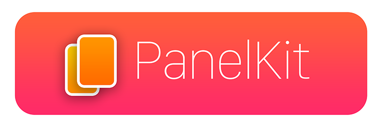

<p align="center">

</p>

<p align="center">
<a href="https://travis-ci.org/louisdh/panelkit"></a>
<a href="https://codecov.io/gh/louisdh/panelkit"></a>
<br>
<a href="https://developer.apple.com/swift/"></a>
<a href="https://cocoapods.org/pods/PanelKit"></a>
<a href="https://github.com/Carthage/Carthage"></a>

<br>
<a href="http://twitter.com/LouisDhauwe"></a>
<a href="https://paypal.me/louisdhauwe"></a>
</p>

<p align="center">

<br>
<i>Applications using PanelKit can be seen in the <a href="SHOWCASE.md">showcase</a>.</i>
</p>


## About
PanelKit is a UI framework that enables panels on iOS. A panel can be presented in the following ways:

* Modally
* As a popover
* Floating (drag the panel around)
* Pinned (either left or right)


This framework does all the heavy lifting for dragging panels, pinning them and even moving/resizing them when a keyboard is shown/dismissed.


## Implementing
A lot of effort has gone into making the API simple for a basic implementation, yet very customizable if needed. Since PanelKit is protocol based, you don't need to subclass anything in order to use it. There a two basic principles PanelKit entails: ```panels``` and a ```PanelManager```.

### Panels
A panel is created using the ```PanelViewController``` initializer, which expects a ```UIViewController```, ```PanelContentDelegate``` and ```PanelManager```.

#### PanelContentDelegate
```PanelContentDelegate ``` is a protocol that defines the appearance of a panel. Typically the ```PanelContentDelegate ``` protocol is implemented for each panel on its ```UIViewController```.


Example:

```swift
class MyPanelContentViewController: UIViewController, PanelContentDelegate {
    
    override func viewDidLoad() {
        super.viewDidLoad()
        
        self.title = "Panel title"	
    }
    
    var preferredPanelContentSize: CGSize {
        return CGSize(width: 320, height: 500)
    }	
}
```  

A panel is explicitly (without your action) shown in a ```UINavigationController```, but the top bar can be hidden or styled as with any ```UINavigationController```.


### PanelManager
```PanelManager``` is a protocol that in its most basic form expects the following:

```swift
// The view in which the panels may be dragged around
var panelContentWrapperView: UIView {
    return contentWrapperView
}

// The content view, which will be moved/resized when panels pin
var panelContentView: UIView {
    return contentView
}

// An array of PanelViewController objects
var panels: [PanelViewController] {
    return []
}
``` 

Typically the ```PanelManager``` protocol is implemented on a ```UIViewController```.

## Advanced features
PanelKit has some advanced opt-in features:

* [Multi-pinning](docs/MultiPinning.md)
* [Panel resizing](docs/Resizing.md)
* [State restoration](docs/States.md)
* [Exposé](docs/Expose.md)

## Installation

### [CocoaPods](http://cocoapods.org)

To install, add the following line to your ```Podfile```:

```ruby
pod 'PanelKit', '~> 2.0'
```

### [Carthage](https://github.com/Carthage/Carthage)
To install, add the following line to your ```Cartfile```:

```ruby
github "louisdh/panelkit" ~> 2.0
```
Run ```carthage update``` to build the framework and drag the built ```PanelKit.framework``` into your Xcode project.


## Requirements

* iOS 10.0+
* Xcode 9.0+

## Todo 

### Long term:
- [ ] Top/down pinning

## License

This project is available under the MIT license. See the LICENSE file for more info.
